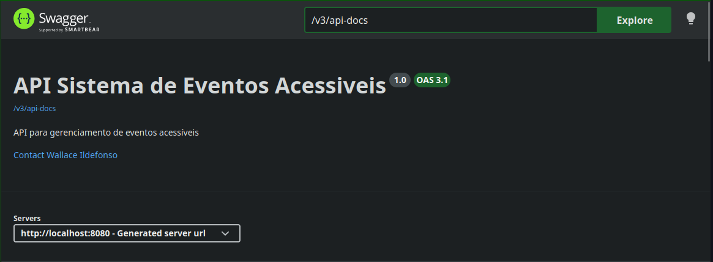
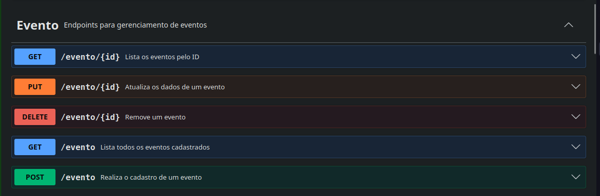
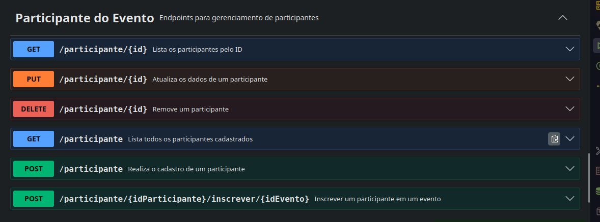
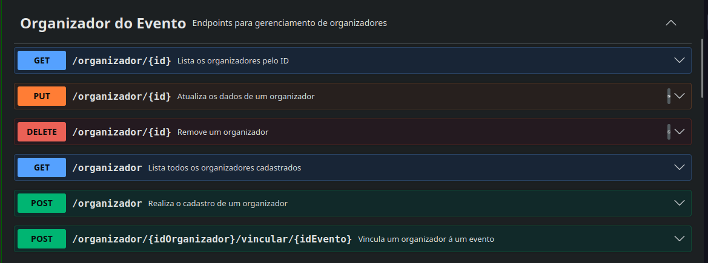
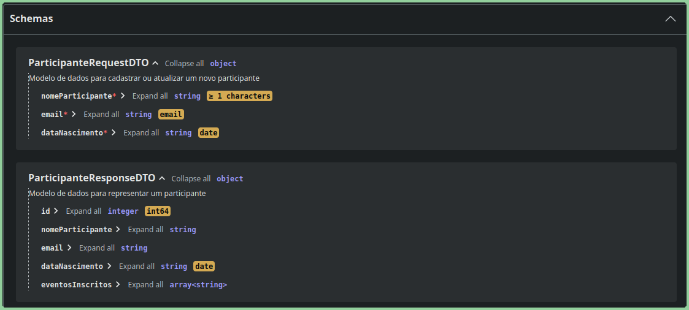

# Sistema de Eventos Acessíveis

Este projeto consiste em uma API REST desenvolvida como parte da Residência em TIC / 
Software do **Serratec** (Turma 37 - Nova Friburgo). O sistema tem como objetivo 
gerenciar eventos focando na acessibilidade, permitindo vincular organizadores 
(Pessoas Físicas e Jurídicas), categorias, locais e recursos especiais de 
acessibilidade para os participantes.

## 👤 Autor
* **Wallace de Oliveira Ildefonso**

## 📝 Descrição do Projeto e Tema Escolhido
O **Sistema de Eventos Acessíveis** é uma plataforma focada na inclusão. Ele centraliza
dados de cursos, eventos, palestrantes e alunos, garantindo que as necessidades de 
acessibilidade (como intérpretes de LIBRAS, audiodescrição, rampas de acesso, entre 
outros) sejam mapeadas desde o cadastro do evento até a inscrição do participante.

O sistema utiliza conceitos avançados de Orientação a Objetos, como herança e polimorfismo
para tratar os tipos de organizadores (Pessoa Física e Pessoa Jurídica), além de contar 
com tratamento global de exceções padronizado pela RFC 7807 (Problem Detail), validações 
customizadas via Bean Validation e documentação interativa automatizada.

---

## 🛠️ Tecnologias Utilizadas
<p align ="left">
    
    
    
</p>
<p align="left">
        
    
    
</p>
<p align="left">
    
    
    
</p>
<p align="left">
    

</p>

---

## 🚀 Instruções de Execução

### Pré-requisitos
* Java JDK 17 ou superior instalado.
* PostgreSQL rodando localmente ou em container.
* Maven instalado.

### Passos para Rodar a Aplicação

1. **Clonar o repositório:**
   ```bash
    git clone https://github.com/arrobateh/serratec.git
    cd ~/serratec/05-Desenvolvimento-de-API-Restful/Sistema-de-Eventos-Acessiveis/

    Configurar o Banco de Dados:
    Abra o arquivo src/main/resources/application.properties e ajuste as credenciais do seu PostgreSQL:
    Properties

    spring.datasource.url=jdbc:postgresql://localhost:5432/eventos-acessiveis
    spring.datasource.username=seu_usuario
    spring.datasource.password=sua_senha
    spring.jpa.hibernate.ddl-auto=update

    Compilar e Rodar o Projeto:
    Execute o comando abaixo na raiz do projeto:
    Bash

    ./mvnw clean spring-boot:run

    Acessar a API:
    A aplicação subirá por padrão na porta 8080.

## 📖 Documentação da API (Swagger / OpenAPI)

Conforme os requisitos estabelecidos, a API foi totalmente documentada utilizando as 
anotações @Operation nos endpoints dos Controllers e @Schema nas propriedades dos DTOs.

Após subir a aplicação, a documentação interativa e a interface de testes podem ser 
acessadas pelo navegador através da URL oficial exigida:
👉 http://localhost:8080/swagger-ui.html


<div>


</div>
<div>


</div>

## 🔍 Exemplos de Endpoints (Conforme DTOs do Sistema)
1. Cadastrar Organizador

   Método: POST

   URL: http://localhost:8080/organizador

   Body (Requisição):
```json
JSON

{
  "nome": "Olimpos Tecnologia S.A.",
  "cnpj": "12345678000199"
}
```

2. Listar Todos os Eventos

   Método: GET

   URL: http://localhost:8080/evento

   Resposta de Sucesso (200 OK) com ordenação por @JsonPropertyOrder:

```Json
JSON

[
  {
    "id": 1,
    "nome": "Workshop de Acessibilidade Digital",
    "dataEvento": "2026-05-25",
    "NomeCategoria": "Tecnologia",
    "organizador": "Serratec Tecnologia S.A.",
    "localEvento": {
        "id": 2,
        "nomeLocal": "Auditório Central"
      },
    "qtdInscritos": 2,
    "nomesParticipantes": [
        "Wallace de Oliveira Ildefonso",
        "Raquel"
      ],
    "feedbacks": [
        "Wallace de Oliveira Ildefonso: Intérprete de LIBRAS excelente"
      ],
    "recursosAcessibilidade": [
      {
        "id": 1,
        "nomeRecurso": "Intérprete de LIBRAS",
        "descricao": "Disponível no palco principal"
      }
    ]
  }
]
```

3. Trata Erro 400 - Validação com @Pattern

    Disparado automaticamente ao enviar um CNPJ que viola a *RegEx ^\\d{14}$*.
    
    Método: POST

    URL: http://localhost:8080/organizador
```json
    Body Inválido: 
    {
        "cnpj": "ab.34s.6f8/ooo1-p9"
    }

    Resposta (400 Bad Request):
    {
        "cnpj": "O CNPJ deve conter apenas números."
    }
```

4. Trata Erro 409 - Conflito de Exclusão (ProblemDetail)

    Interceptado e tratado pela GlobalExceptionHandler através do DataIntegrityViolationException ou InvalidDataAccessApiUsageException, retornando o status 409 sem expor erros 500 no console.

    Método: DELETE

    URL: http://localhost:8080/categorias/1

    Resposta (409 Conflict):

```json
JSON

{
    "title": "Violação de Integridade de Dados",
    "status": 409,
    "detail": "Não é possível excluir este registro porque ele está vinculado à outros dados",
    "instance": "/categoria/1"
}
```

## 💡 Observações Técnicas Relevantes

1. Flexibilidade nos Vínculos: O sistema permite o cadastro independente de RecursoAcessibilidade puro, fornecendo um 
endpoint dedicado no controller (/recursos/{idRecurso}/vincular/{idEvento}) para executar a associação na tabela 
intermediária @ManyToMany de forma posterior.
