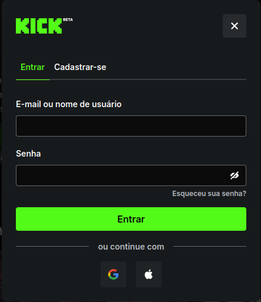

# Mistério React 🕵️‍♂️📺

Um exercício desenvolvido em **React** para praticar a criação de componentes, estilização e estruturas básicas de páginas modernas (inspirado em interfaces de streaming e criadores de conteúdo).

---

## 📸 Preview do Projeto

Aqui está uma demonstração da tela de login do site oficial:



---

## 🛠️ Tecnologias e Ferramentas Utilizadas

* **Ambiente de Desenvolvimento:** Linux (Pop!_OS)
* **IDE:** IntelliJ IDEA Ultimate
* **Framework/Biblioteca:** [React](https://react.dev/) + [Vite](https://vitejs.dev/)
* **Estilização:** Styled Components / CSS Modules
* **Linguagem:** JavaScript (JSX)

---

## 🚀 Como Executar o Projeto

Para clonar e rodar esta aplicação localmente, você vai precisar do [Node.js](https://nodejs.org/) instalado em seu sistema Linux.

### 1. Clonar o Repositório
```bash
git clone https://github.com/arrobateh/misterio-react.git
cd misterio-react